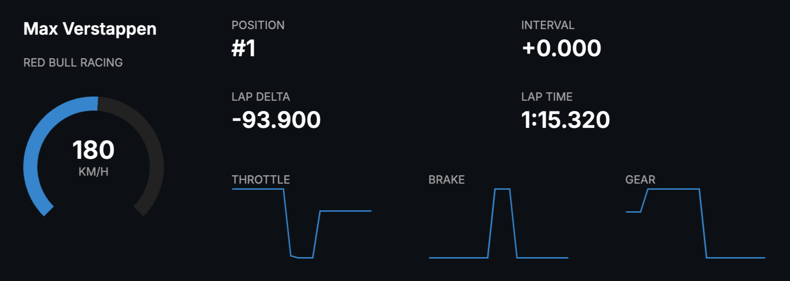

# Verstappen F1 Live Tracker Dashboard

This is a live telemetry dashboard for Max Verstappen using real-time data from the [OpenF1 API](https://openf1.org). It displays his speed, position, lap time, interval, throttle, brake, gear, and more.

## 🔗 Live Dashboard

👉 [Visit the Live Site](https://v0-verstappen-tracker-frontend.vercel.app/)

## 🧠 Features

- Live speed gauge (km/h)
- Current position and interval
- Lap time and delta
- Throttle, brake, and gear graphs
- Clean and dark UI optimized for race viewing

## 📷 Screenshot

## 🛠️ Backend Repository

The backend handles data retrieval and processing from OpenF1's API.

🔧 [GitHub – f1-backend](https://github.com/florianmgedeon/f1-backend)

---

Built with ❤️ by [@florianmgedeon](https://github.com/florianmgedeon)
